# Modernizing an Application to Windows Containers on Service Fabric

* [Introduction](#introduction)
* [Learning Objectives](#learning-objectives)
* [Prerequisites](#prerequisites)
* [Create a Team Project and Repository](#create-a-team-project-and-initial-code)
* [Configure Container Register](#configure-container-registry)
* [Containerize the Application](#containerize-the-application)
* [Create Service Fabric Cluster](#create-service-fabric-cluster)

## Introduction
The goal of this POC is to walkthrough the process you would follow when it comes to migrating an existing application running on-premise to run in a Service Fabric cluster. You will start by creating a new .NET Core application, converting it to a containerized instance, deploying it to a registry, and then running the application within Service Fabric.

## Learning Objectives
After completing this exercise, you will be able to:
* Wrap an existing application into a container
* Create a Service Fabric Cluster on your local development environment as well as in Azure.
* Build and deploy the container through a CI/CD process

## Prerequisites
To complete this POC, you will need
* You must have access and be able to deploy into a Microsoft Azure Subscription
* Visual Studio 2017
* [.NET Core 2.0 SDK](https://www.microsoft.com/net/download/core)
* [Docker for Windows](https://www.docker.com/docker-windows)
* You should have access to a Visual Studio Team Services Account. In particular, you should have access to a Team Project, where you can commit code, create and maintain Build / Release Definitions Find more information about [creating a VSTS account](https://docs.microsoft.com/en-us/vsts/accounts/create-account-msa-or-work-student)
* You will need the [Service Fabric SDK](http://www.microsoft.com/web/handlers/webpi.ashx?command=getinstallerredirect&appid=MicrosoftAzure-ServiceFabric-CoreSDK) installed
  > Note: In order for Visual Studio to be able to deploy to your local cluster, you will need to run the following from an elevated command prompt:
  > ```
  > powershell Set-ExecutionPolicy -ExecutionPolicy Unrestricted -Force -Scope CurrentUser
  > ```

## Create a Team Project and Initial Code
1. From the VSTS portal, click **New Project**

    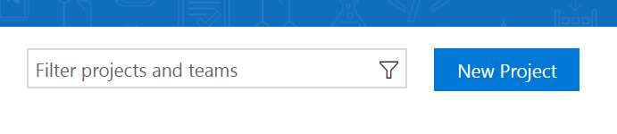

2. Give it a project name and make sure *Version Control* is set to **Git**, then click **Create**.

    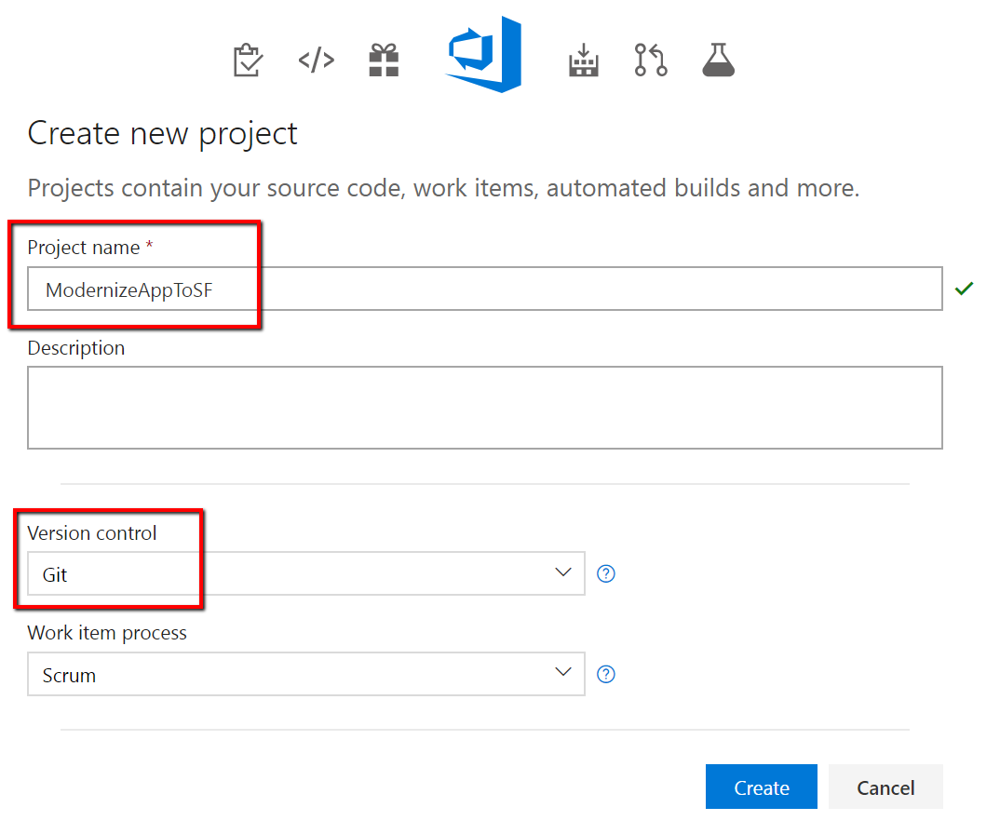
    
3. On the welcome page, click on the down arrow to initialize the Git repository with a gitignore file and set the gitignore type to VisualStudio. Click **Initialize**.

    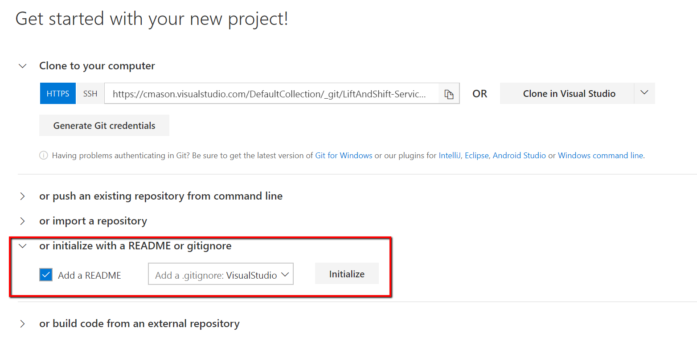
    
4. Click the **Code** hub at the top of the page and then click **Clone** at the top right.

    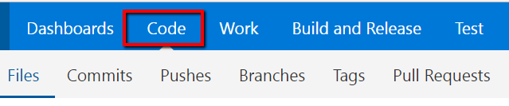
    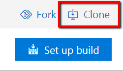
    
5. In the *Clone repo* dialog, click **Clone in Visual Studio**

    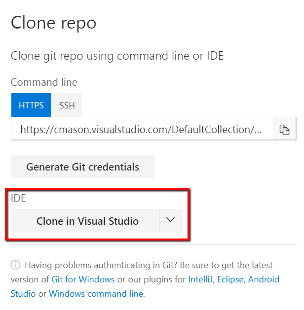
    
6. Complete the clone dialog in Visual Studio and click **Clone**.
7. In Visual Studio, click **File** -> **New Project** and select **ASP.NET Core Web Application**.

    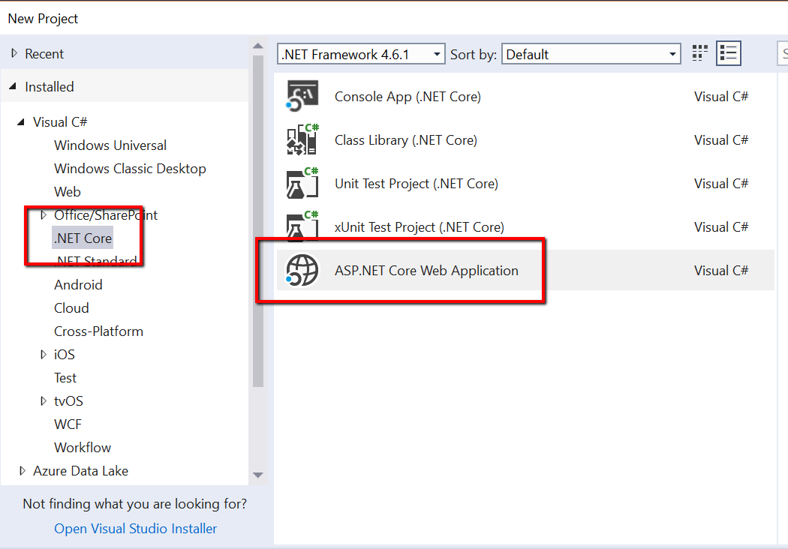
    
8. Give a name for your project e.g. *ContosoExpensesWeb* and set the location to be the folder you cloned your repository to. Click **Ok**.
9. In the project template dialog, select **Web Application**, and then click **Change Authentication** and select **Individual User Accounts** and then click **Ok** and then **Ok** again.

    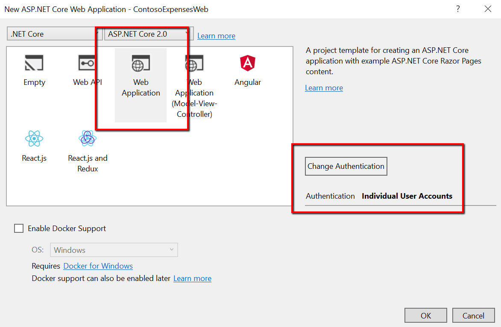
    
10. Build and run your application to make sure everything is ready to go.
    > Note: Make sure you try creating an account as well to verify the identity pieces are working.

## Configure Container Registry
We will need a place to store the containers that we are creating for this application. For this example we will be creating an Azure Container Registry.

1. Log into the [Azure portal](https://portal.azure.com).
2. Create a new resource and search the marketplace for **Azure Container** and select **Azure Container Registry**.

    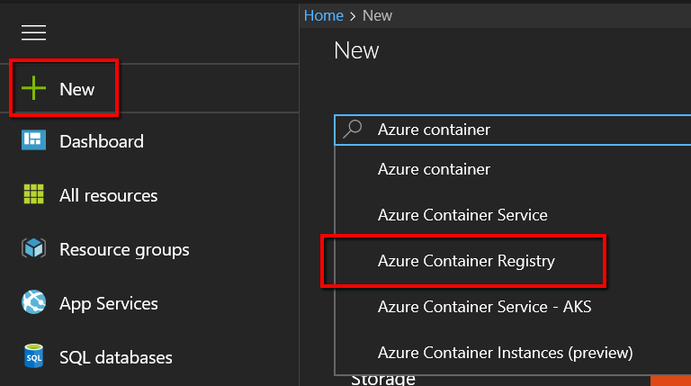

3. Give the registry a name and assign it to a resource group. Click **Create**.

    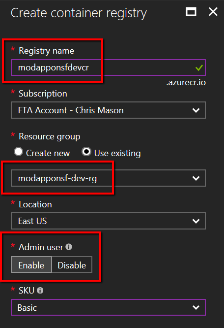


## Containerize the Application
The application as it exists today would be considered a traditional "monolithic" application. We now need to containerize the application so it can work on Docker. With the Docker Tools for Windows, we can do some basic Docker scaffolding of our project.

1. In Visual Studio, right click the project, click **Add** and then **Docker Support**. Select **Windows** for the Target OS and then click **Ok**.
2. Visual Studio will create a Dockerfile for the application along with a docker-compose file.
    > Note: Attempting to run the application again will not currently work because the application will not be able to connect to the SQL instance running on *localhost*.
3. In Visual Studio, Right-click the web application and click **Publish**. In the publish dialog, select **Container Registry** and then **Select Existing Container Registry**. Click **Publish** and fill out the connection information to your subscription and container registry created in the previous step. Click **Ok**.

    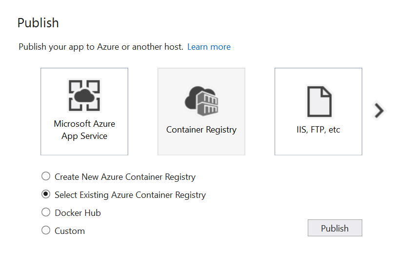


    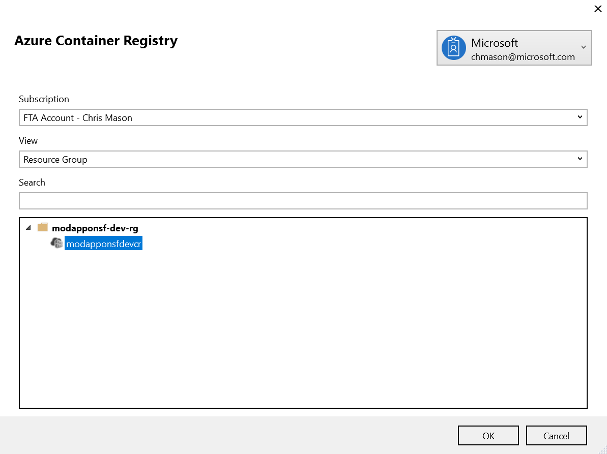

## Create Service Fabric Cluster